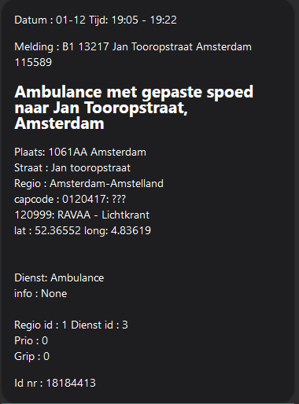
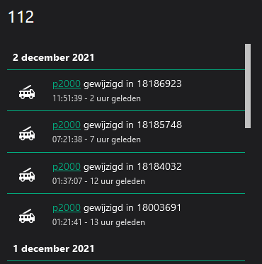

# P2000 Sensor

This is a simple p2000 sensor for home assistant

### Installation

Copy this folder to `<config_dir>/custom_components/p2000/`.

Add the following to your `configuration.yaml` file:


```yaml
# Example configuration.yaml entry
sensor:
  - platform: p2000
    name: Brandweer
    icon: mdi:fire-truck
    gemeenten:
      - Zwolle
    diensten:
      - 2

  - platform: p2000
    icon: mdi:ambulance
    name: Ambulance
    gemeenten:
      - Zwolle
    diensten:
      - 3

  - platform: p2000
    name: IJsselland
    regios:
      - 17

  # Only prio1 of region 17
  - platform: p2000
    name: IJsselland Prio1
    prio1: true
    regios:
      - 17
```


When applying multiple properties all will be applied as filter!

###  regios (Veiligheidsregios)
```
1: Amsterdam-Amstelland
2: Groningen
3: Noord- en Oost Gelderland
4: Zaanstreek-Waterland
5: Hollands Midden
6: Brabant Noord
7: Friesland
8: Gelderland-Midden
9: Kennemerland
10: Rotterdam-Rijnmond
11: Brabant Zuid-Oost
12: Drenthe
13: Gelderland-Zuid
14: Zuid-Holland Zuid
15: Limburg-Noord
17: IJsselland
18: Utrecht
19: Gooi en Vechtstreek
20: Zeeland
21: Limburg-Zuid
23: Twente
24: Noord-Holland Noord
25: Haaglanden
26: Midden- en West Brabant
27: Flevoland
```
## diensten
```
1: Politie
2: Brandweer
3: Ambulance
4: KNRM
5: Lifeliner
7: DARES
```
## lifeliners
```
If `true`; All notifications, regardless of the region
```


You should get a sensor like te following with a lot of attributes.

The id is unique and changes with every new p2000 message.


Extracting data can be done with a template like:

`{{ state_attr('sensor.p2000_zwolle', 'melding') }}`

----------------------------------------------------------------------------------
### lovelace Dashboard

You need markdown and logbook for the following settings

More information on your dashboard.<br> tekst in Dutch.<br>


#### markdown card
```
type: markdown
content: >
  Datum : {{ state_attr('sensor.p2000', 'datum' ) }}   Tijd: {{
  state_attr('sensor.p2000', 'tijd') }}


  Melding : {{ state_attr('sensor.p2000', 'melding') }}<br>


  {{ state_attr('sensor.p2000', 'tekstmelding') }}<br>

  -

  Plaats: {{ state_attr('sensor.p2000', 'plaats') }}

  Straat : {{ state_attr('sensor.p2000', 'straat') }} 

  Regio : {{ state_attr('sensor.p2000', 'regio') }}

  capcode : {{ state_attr('sensor.p2000', 'capstring') }}

  lat : {{ state_attr('sensor.p2000', 'latitude') }}  long: {{
  state_attr('sensor.p2000', 'longitude') }}

  <br>

  Dienst: {{ state_attr('sensor.p2000', 'dienst') }}

  info :  {{ state_attr('sensor.p2000', 'brandinfo') }}<br>

  Regio id : {{ state_attr('sensor.p2000', 'regioid') }}       Dienst id : {{
  state_attr('sensor.p2000', 'dienstid') }}

  Prio : {{ state_attr('sensor.p2000', 'prio1') }}

  Grip : {{ state_attr('sensor.p2000', 'grip') }}


  Id nr : {{ state_attr('sensor.p2000', 'id') }}<br>
```
----------------------------------------------------------------------------------
Also <br>


#### logbook card
```
type: logbook
entities:
  - sensor.p2000
hours_to_show: 24
title: '112'
```
